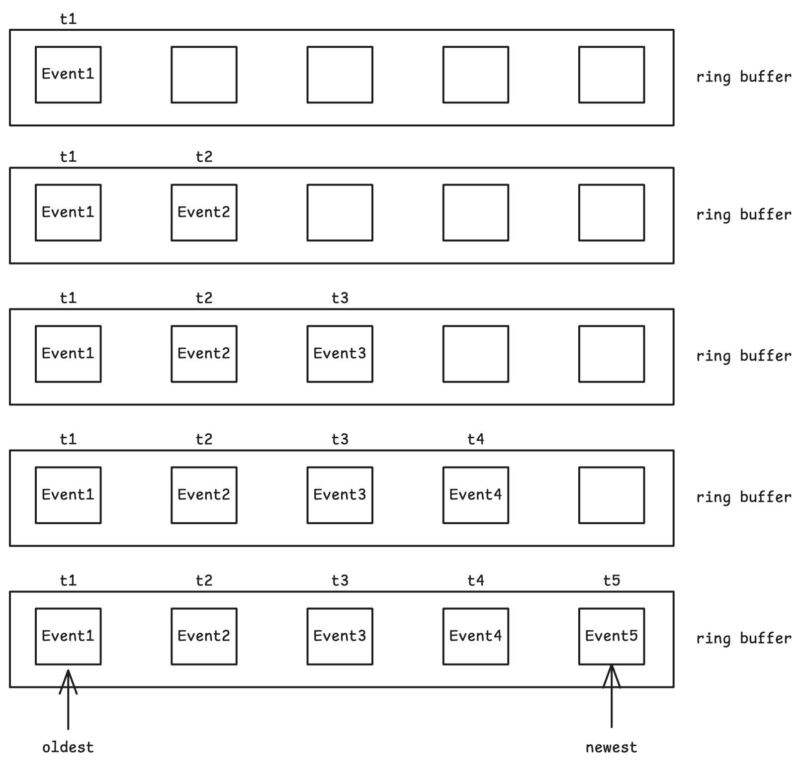
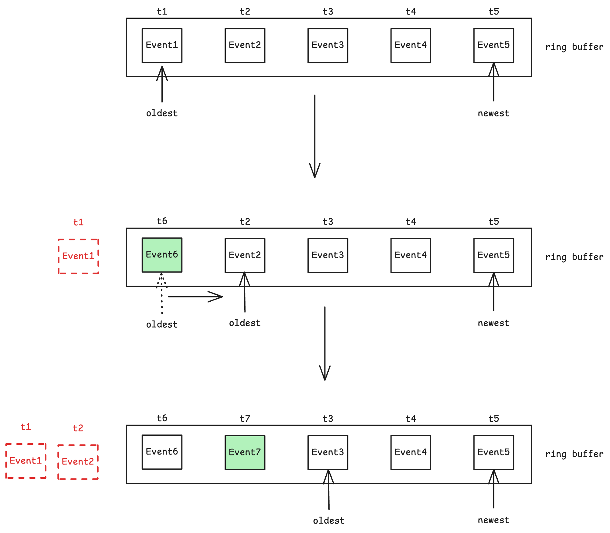

# Ring Buffer






## Test

- terminal1

```bash
$ curl "http://localhost:8080/api/v1/watch/public/prod/?revision=1&timeout=30"
```

- terminal2

```bash
$ curl -X PUT http://localhost:8080/api/v1/config/public/prod/db_host -d '10.0.0.1'
```


terminal1 immediately receives the update:

```bash
$ curl "http://localhost:8080/api/v1/watch/public/prod/?revision=0&timeout=30"
{"revision":1,"events":[{"type":"PUT","entry":{"key":"public/prod/db_host","value":"10.0.0.1","revision":1,"create_revision":1,"mod_revision":1,"version":1}}]}
```

